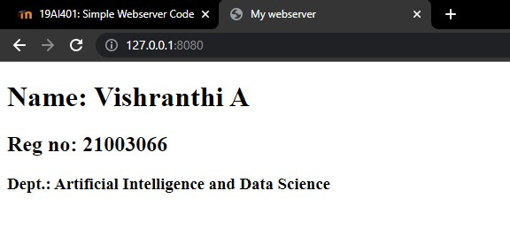

# Experiment_Basic_HTML_Tag

## AIM
To Write a html webpage using heading, paragraph and list tags.

# ALGORITHM
### STEP 1
create a simple html page using heading tag.
### STEP 2
Add a paragragh tag to the program.
### STEP 3
Execute the program.
### STEP 4
Stop the program.

# CODE
~~~
from http.server import HTTPServer, BaseHTTPRequestHandler
content = """
<!DOCTYPE html>
<html>
<head>
<title>My webserver</title>
</head>
<body>
<h1>Name: Vishranthi A </h1>
<h2>Reg no: 21003066 </h2>
<h3>Dept.: Artificial Intelligence and Data Science</h3>
</body>
</html>
"""
class myhandler(BaseHTTPRequestHandler):
    def do_GET(self):
        print("request received")
        self.send_response(200)
        self.send_header('content-type', 'text/html; charset=utf-8')
        self.end_headers()
        self.wfile.write(content.encode())
server_address = ('',8080)
httpd = HTTPServer(server_address,myhandler)
print("my webserver is running...")
httpd.serve_forever()
~~~
# OUPUT

# RESULT

Thus the webserver is created successfully.